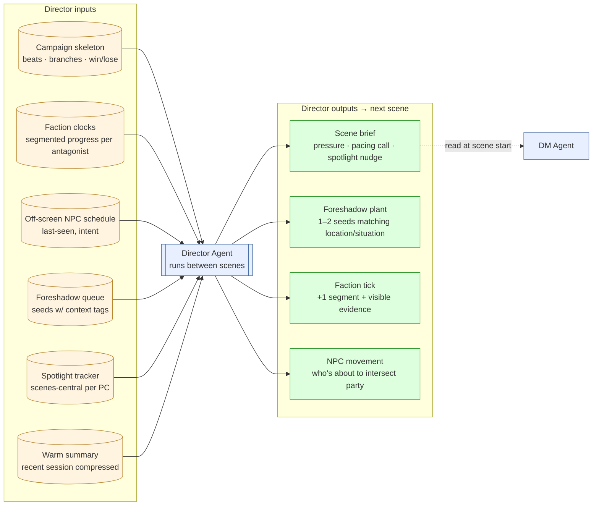
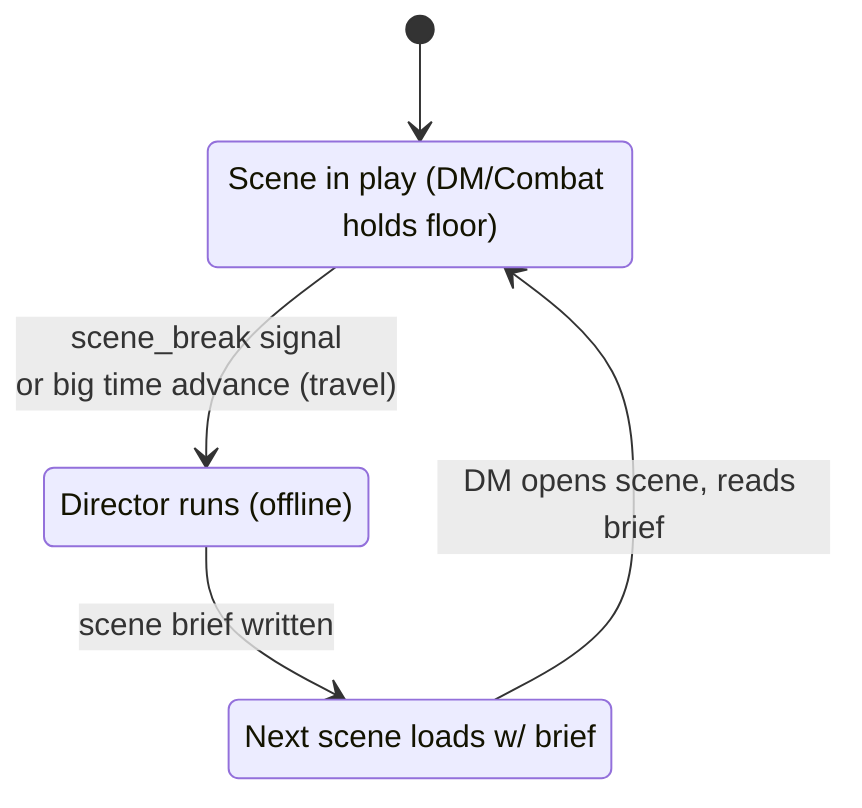
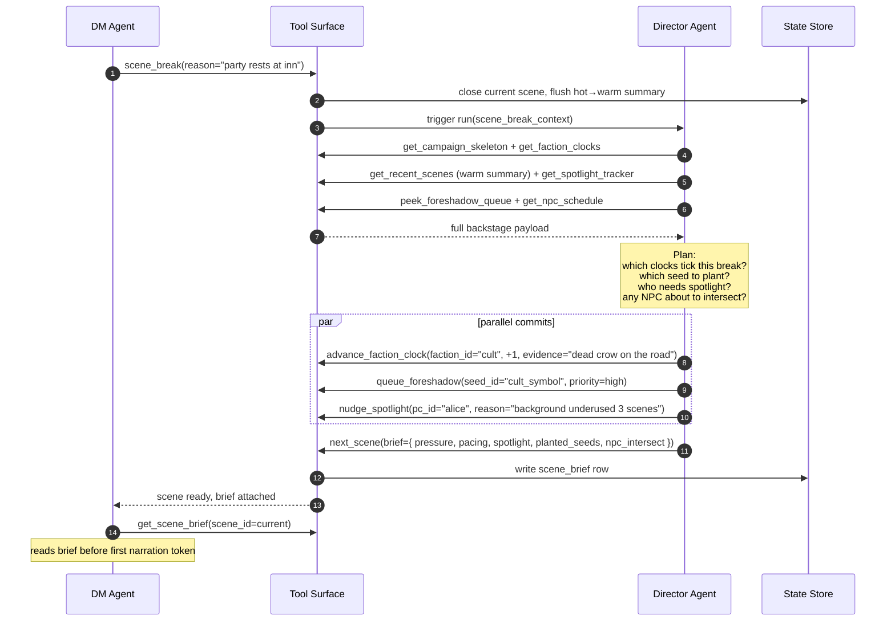
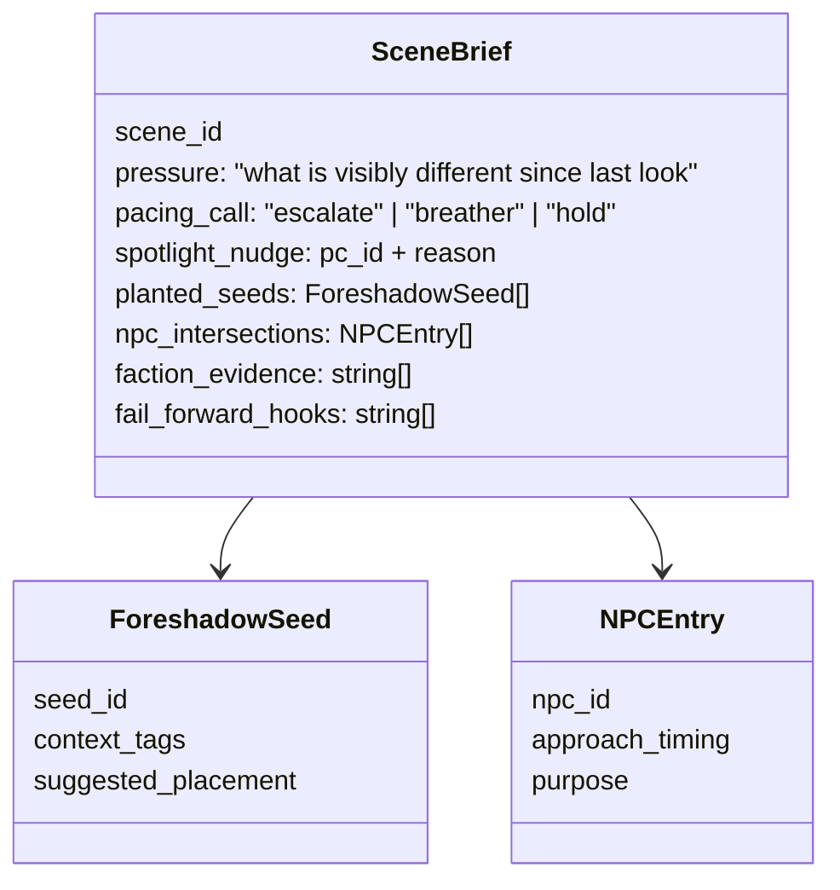
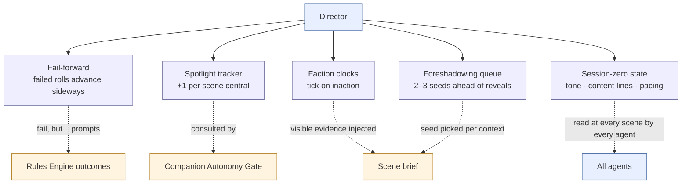

# Director — Between-Scenes Planner

**Source**: [`05-director.md`](../../05-director.md)

The Director is *not* a narrator. It's the stage manager: it never speaks to
the player, it runs only between scenes (and after big time advances), and
its only output is a short **scene brief** that the DM agent reads at scene
start.

## Conceptual view — inputs and outputs

## When the Director runs

The Director **never** runs mid-scene. Its cadence is deliberately
in-between: it gets all the time it needs (no player waiting on a streamed
reply), can spend tokens on careful planning, and doesn't risk breaking
narrative flow.

## Sequence — scene_break → Director run → next scene

## What the scene brief actually contains

## The "best DM practices" scaffolds (Director-owned, not DM-owned)

These are deliberately *not* in the DM prompt. Putting them in the Director
keeps the DM lean and focused on the current moment; the Director carries
the campaign-wide discipline.

## What the Director does NOT do

- Speak to the player (ever)
- Intervene mid-scene
- Override player choice (it nudges; it does not force)
- Touch the rules engine (no rolls — that's the per-actor turn loop's job)

## See also

- The five scaffolds in prose: [`05-director.md`](../../05-director.md) §"Best DM practices" scaffolds
- The spotlight tracker feeding Companion autonomy: [`../party-shapes/01-solo-ai-companion.md`](../party-shapes/01-solo-ai-companion.md)
- Travel-time Director hook: [`../travel/01-party-movement-flow.md`](../travel/01-party-movement-flow.md)
- Campaign authoring format (where faction clocks and foreshadow seeds are defined): [`../generation/01-campaign-authoring-validation.md`](../generation/01-campaign-authoring-validation.md)
