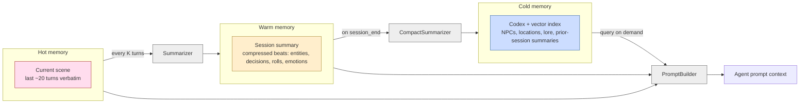
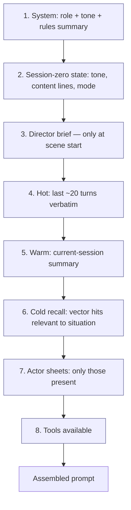
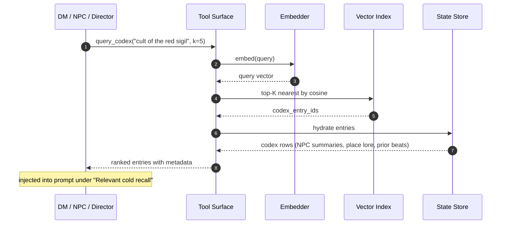
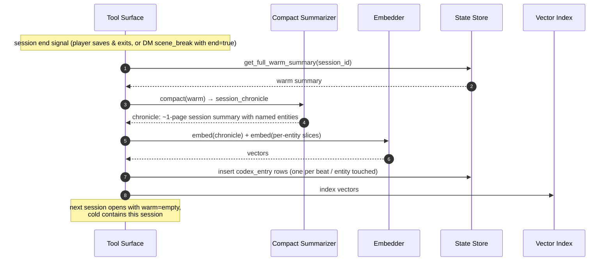
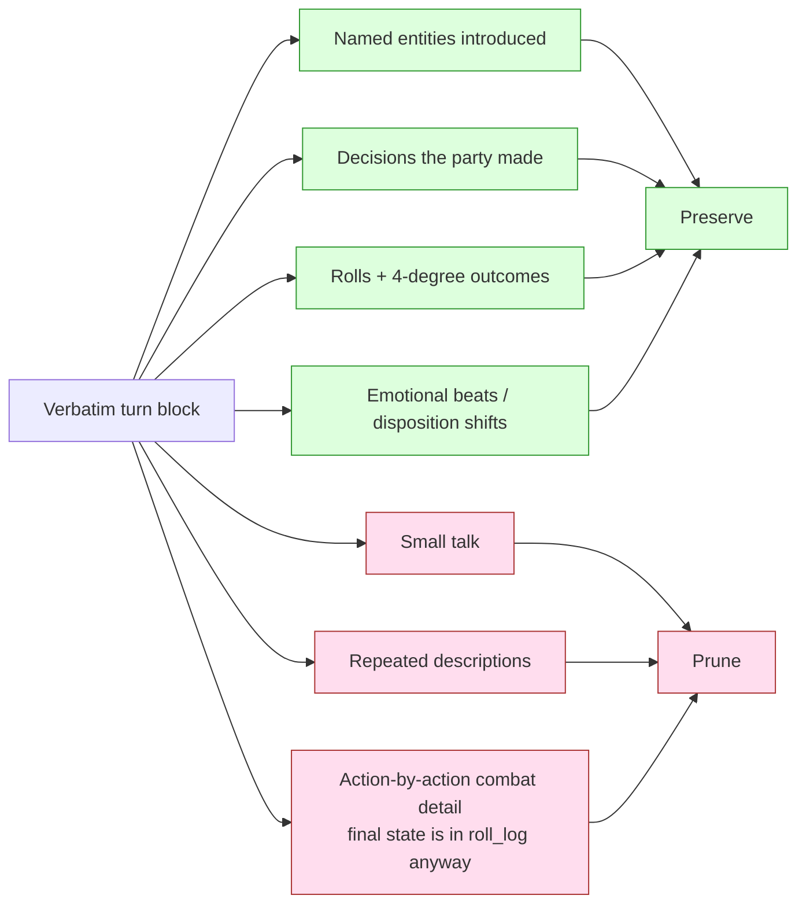

# Memory Tiers + Summarizer

**Source**: [`00-overview.md`](../../00-overview.md) §Four layers, [`08-cross-cutting.md`](../../08-cross-cutting.md) §Summarizer

The DM's effective memory is layered. **Hot** is the current scene verbatim,
**warm** is the current session compressed, **cold** is everything else
retrievable via vector codex. The summarizer is what moves content from hot
to warm. Cold recall is a query, not a transition.

> This is *engine* memory (what gets injected into agent prompts). NPC
> memory is a separate, structured store — see
> [`../core-loops/03-npc-reencounter-memory.md`](../core-loops/03-npc-reencounter-memory.md).

## Conceptual view — the three tiers



## Context budget layering per turn

What actually ends up in an agent's prompt every beat, in priority order
(from [`02-tools-orchestration.md`](../../02-tools-orchestration.md) §Context budgeting):



Higher tiers are non-negotiable; lower tiers shrink first under token
pressure. Cold recall is bounded (top-K), so the prompt size is predictable.

## Sequence — summarizer run (hot → warm)

Cadence: every K turns (likely 10–20, TBD).

```mermaid
sequenceDiagram
    autonumber
    participant T as Tool Surface
    participant Sum as Summarizer Agent<br/>(small/cheap model)
    participant S as State Store
    participant V as Vector Index

    Note over T: turn counter passes K threshold
    T->>S: get_hot_scene(window=K turns)
    S-->>T: verbatim turns
    T->>Sum: compress(turns)<br/>"preserve: entities, decisions, rolls, emotional beats"
    Sum-->>T: tight summary
    T->>S: append warm_summary chunk
    T->>S: prune hot down to last ~5 turns + new summary anchor
    Note over T: warm grows incrementally; hot stays bounded
```

The summarizer is a cheap-model job, not a DM task. Keeping it out of the DM
agent's loop keeps it isolated and testable.

## Sequence — cold recall on demand

Triggered when the DM or an agent needs context beyond the current session
(e.g., "what did Vellis say two sessions ago about the cult?").



## Session-end → cold compaction



## What gets preserved vs. pruned (summarizer policy)



## See also

- NPC memory is a *separate* mechanism (per-NPC, structured): [`../core-loops/03-npc-reencounter-memory.md`](../core-loops/03-npc-reencounter-memory.md)
- Cost tiering for cheap-model jobs: [`08-cross-cutting.md`](../../08-cross-cutting.md) §Cost optimization
- The roll_log audit trail referenced above: [`02-tools-orchestration.md`](../../02-tools-orchestration.md) §Key invariants
- Open: cadence tuning, eval for "did the summarizer preserve the right things": [`TODO-BRAINSTORM.md`](../../TODO-BRAINSTORM.md) §Summarizer
