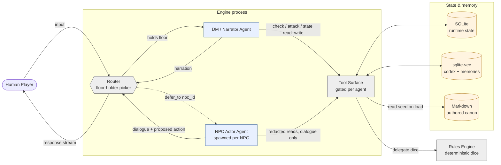
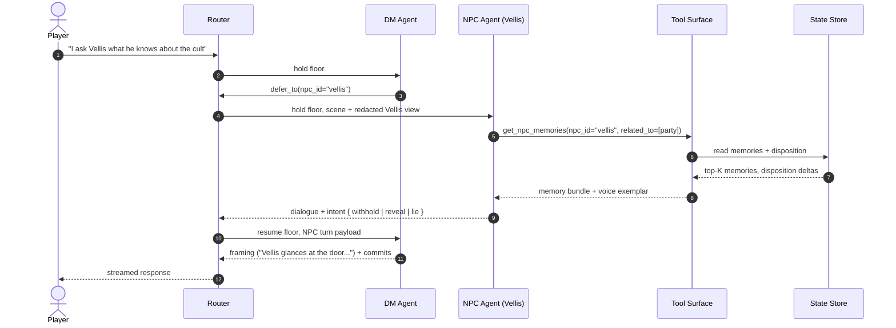

# Solo Free Play — Default Turn Loop

**Source**: [`02-tools-orchestration.md`](../../02-tools-orchestration.md), [`00-overview.md`](../../00-overview.md)

The baseline scenario: one human player, the DM agent holding the floor most
of the time, with occasional handoffs to an NPC actor agent for substantial
dialogue. This is the spine — every other scenario is a variation on it.

## Conceptual view

Who exists, what they can touch, who decides who speaks next.



**Key invariants visible above** (enforced by the tool layer, not the prompt):

- Only one agent holds the floor at a time. The Router is the only thing that picks the next speaker.
- Agents never touch storage directly — everything funnels through the Tool Surface.
- The DM cannot call `roll()`; it must request resolution via `check` / `attack`, which run in the Rules Engine.
- NPC reads are redacted to what that NPC plausibly knows; redaction lives in the tool layer.

## One beat — sequence

The default cadence when nothing exotic happens. Most of the screen time is in
the `RESOLVING → NARRATING → COMMITTING` band.

```mermaid
sequenceDiagram
    autonumber
    actor P as Player
    participant R as Router
    participant DM as DM Agent
    participant T as Tool Surface
    participant RE as Rules Engine
    participant S as State Store

    P->>R: input ("I search the desk")
    R->>DM: hold floor, current scene context
    DM->>T: get_scene / get_actor / query_codex
    T->>S: read
    S-->>T: scene + actor + relevant cold recall
    T-->>DM: context payload
    DM->>T: check(actor_id, "perception", DC=15)
    T->>RE: roll d20 + mods vs DC
    RE-->>T: outcome { degree: success, total: 19 }
    T-->>DM: result
    DM->>T: transfer_item(desk → player, "letter")
    T->>S: write (audited)
    DM-->>R: narration stream + proposed_state_changes
    R-->>P: streamed narration
    Note over R,S: scene.append(narration); loop back to AWAITING_INPUT
```

## When the DM defers to an NPC

The trigger is "substantial dialogue" — more than a one-liner, especially when
the NPC has a distinct voice or hidden agenda the DM shouldn't speak for.



The NPC agent never narrates the scene itself — it returns dialogue and an
*intent*. The DM resumes and frames the result. This is what kills the
"DM speaks, NPC speaks, DM speaks again in the same beat" tic.

## See also

- Turn-loop state machine (zoomed out): [`02-tools-orchestration.md`](../../02-tools-orchestration.md) §Turn-loop state machine
- What "redacted view" actually means: [`02-tools-orchestration.md`](../../02-tools-orchestration.md) §Agent permissioning matrix
- Where memories come from: [`03-npc-reencounter-memory.md`](03-npc-reencounter-memory.md)
