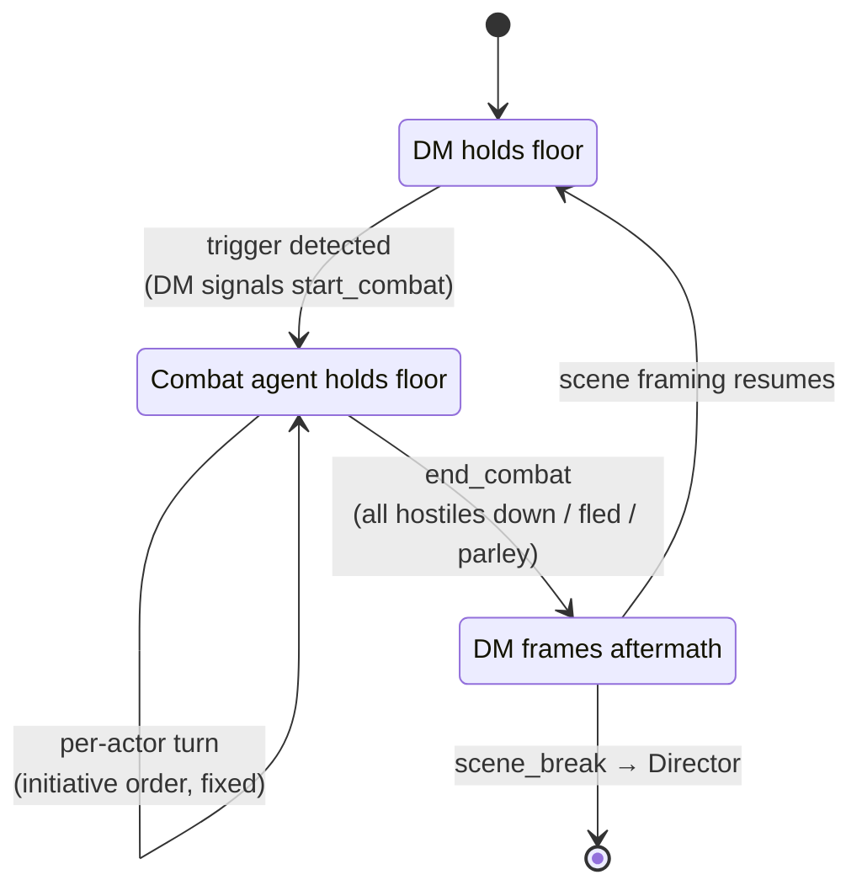
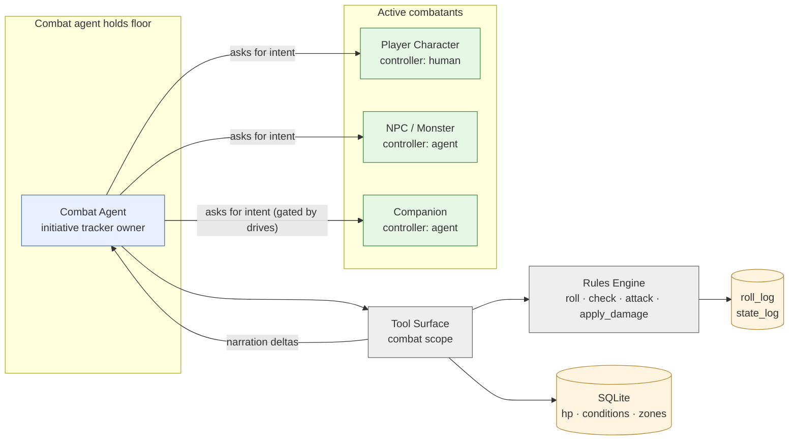
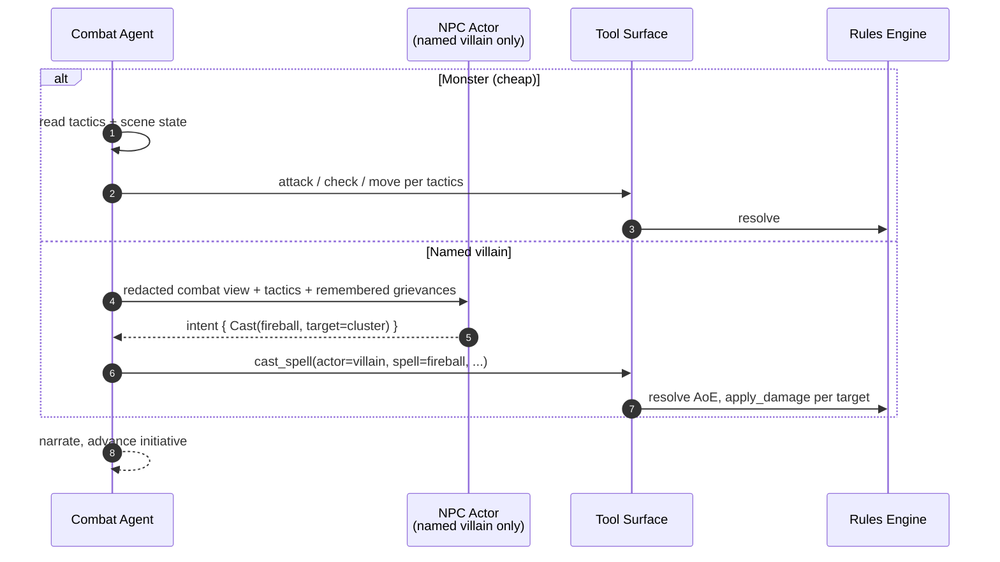
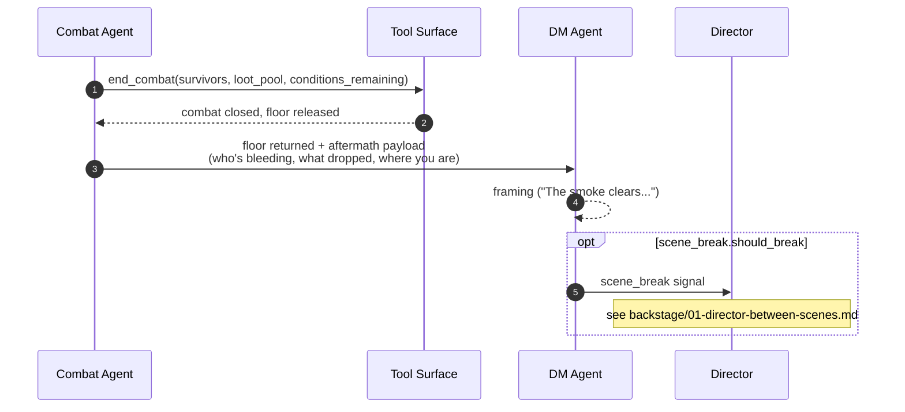

# Combat Encounter — Floor Handoff + 3-Action Turn

**Source**: [`03-rules-combat.md`](../../03-rules-combat.md), [`02-tools-orchestration.md`](../../02-tools-orchestration.md)

When initiative is rolled, the **Combat agent** takes the floor from the DM
and holds it until `end_combat`. This is the cleanest example of the
floor-holding model: only one agent narrates per beat, and the rules engine
owns every dice result.

## Floor-holding state machine

Zoomed out across an encounter. The DM agent never narrates combat beats —
the Combat agent does — but the DM resumes scene framing the moment combat
resolves.



## Conceptual view — who participates in a combat turn



The Combat agent is the only thing that talks. It *asks* each actor (human or
agent) for an intent, then resolves and narrates. PCs don't speak narration;
they speak intent.

## One combat turn — sequence (3-action economy)

The PF2e-lightweight model: each actor has 3 actions per turn. The Combat
agent loops `request intent → resolve → narrate` until actions are spent.

```mermaid
sequenceDiagram
    autonumber
    participant CA as Combat Agent
    actor P as Player (PC's turn)
    participant T as Tool Surface
    participant RE as Rules Engine
    participant S as State Store

    CA->>P: "Aria, you have 3 actions. Conditions: off-guard. What do you do?"
    P-->>CA: "Stride to the warlock, Strike, Demoralize"

    rect rgb(245,245,255)
    Note over CA,RE: Action 1 — Stride (movement, no roll)
    CA->>T: move_actor(actor=aria, to_zone=near(warlock))
    T->>S: write position
    end

    rect rgb(245,255,245)
    Note over CA,RE: Action 2 — Strike
    CA->>T: attack(actor=aria, target=warlock, weapon=longsword)
    T->>RE: d20 + atk vs AC; 4-degree outcome
    RE-->>T: { degree: success, damage_roll }
    T->>RE: apply_damage(target=warlock, amount)
    RE->>S: write hp, log roll
    T-->>CA: outcome payload
    end

    rect rgb(255,250,240)
    Note over CA,RE: Action 3 — Demoralize
    CA->>T: check(actor=aria, skill=intimidation, dc=warlock.will_dc)
    T->>RE: d20 + cha
    RE-->>T: { degree: success }
    T->>S: set_condition(warlock, "frightened-1", duration=1 round)
    end

    CA-->>P: 2-sentence narration of the full turn + state deltas
    CA->>CA: advance initiative pointer
    Note over CA: next actor (NPC / monster / Companion)
```

## When the Combat agent asks an NPC/monster for intent

Monsters have a `tactics` string (`"focuses spellcasters, retreats below 25% HP"`).
The Combat agent reads it and either decides itself (cheap monsters) or
spawns a one-shot NPC actor (named villains, complex bosses).



## Hand-off back to DM



## See also

- 3-action economy and 4-degree outcome ladder: [`03-rules-combat.md`](../../03-rules-combat.md)
- Why `roll()` is not in the DM's tool surface: [`02-tools-orchestration.md`](../../02-tools-orchestration.md) §Key invariants
- Companion autonomy gates in combat: [`../party-shapes/01-solo-ai-companion.md`](../party-shapes/01-solo-ai-companion.md)
