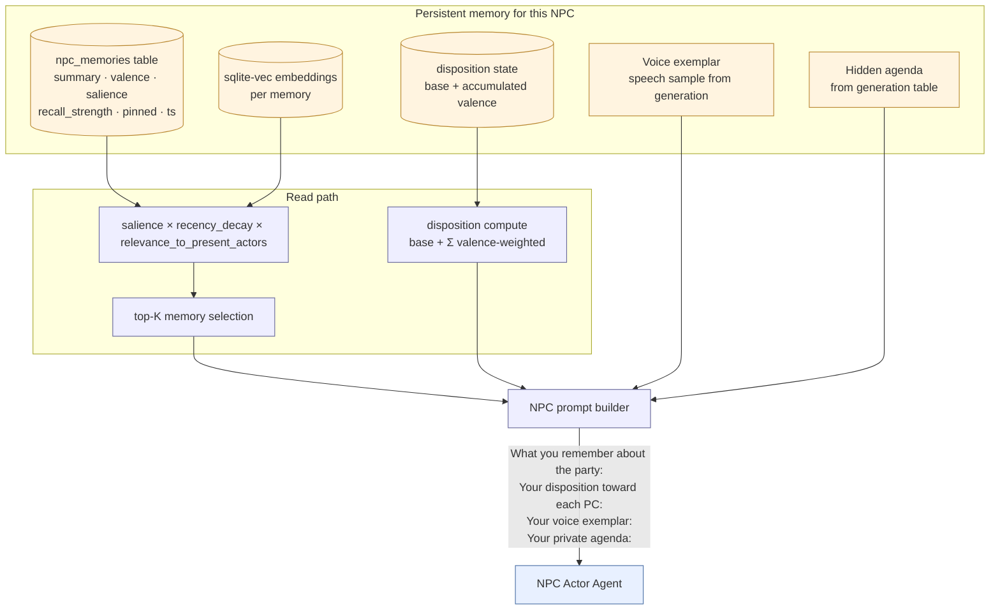
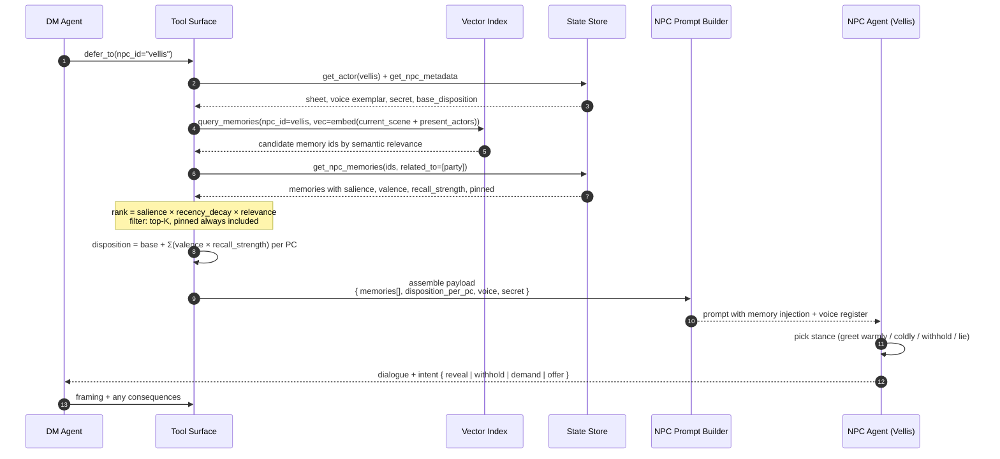
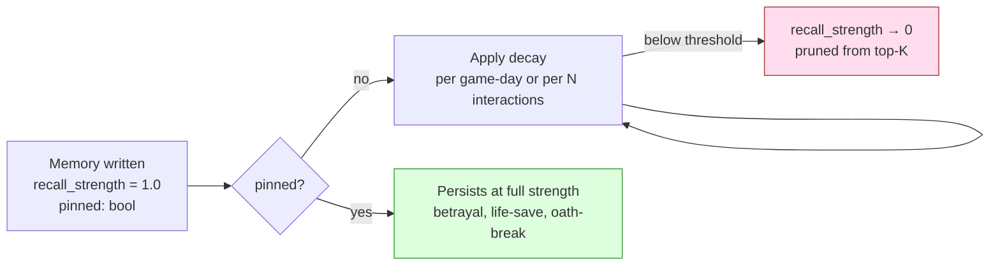

# NPC Re-encounter — Memory + Disposition Recall

**Source**: [`04-npc-memory.md`](../../04-npc-memory.md)

The bartender remembers you tipped well in session 1 and greets you warmly in
session 12 — without the DM holding it in context. The lookup is *structural*:
the system remembers, then tells the LLM.

## Conceptual view — memory layers feeding the NPC



## Sequence — "the party walks into Vellis's shop again"

The re-encounter trigger fires the moment the NPC is about to take a speaking
turn (or proactively appear in narration), not when the location loads.



## Write path — what gets committed after the encounter

Memories are written from the NPC's POV, with the DM scoring salience based on
how significant the moment was for *that NPC*.

```mermaid
sequenceDiagram
    autonumber
    participant DM as DM Agent
    participant T as Tool Surface
    participant E as Embedder
    participant V as Vector Index
    participant S as State Store

    Note over DM: Scene closes with a memorable beat<br/>(party paid full price + tipped)

    DM->>T: commit_npc_memory(<br/>  npc_id=vellis,<br/>  summary="Party paid full + tipped on silk",<br/>  valence=+2, salience=4,<br/>  related_actor_ids=[bob],<br/>  pinned=false)
    T->>E: embed(summary + context)
    E-->>T: vector
    T->>V: index(memory_id, vector)
    T->>S: insert npc_memories row
    Note over T: write-through; LLM never touches storage
```

## Decay & pinning



Pinning is set at write-time by the DM based on event intensity. The Director
can also manually pin/unpin during between-scene runs if a memory turns out to
be more (or less) important than first scored.

## Cross-NPC memory (deferred)

Faction-wide propagation (`"the guild knows you stiffed Vellis"`) would happen
in the Director loop, not the per-NPC read path. See [`04-npc-memory.md`](../../04-npc-memory.md) §Cross-NPC memory.

## See also

- Where the initial 3–5 memory entries come from: [`generation/02-entity-generation-pipeline.md`](../generation/02-entity-generation-pipeline.md)
- Why the NPC sees redacted state: [`02-tools-orchestration.md`](../../02-tools-orchestration.md) §Agent permissioning matrix
- Hot/warm/cold scene memory (separate from NPC memory): [`../backstage/02-memory-tiers-summarizer.md`](../backstage/02-memory-tiers-summarizer.md)
