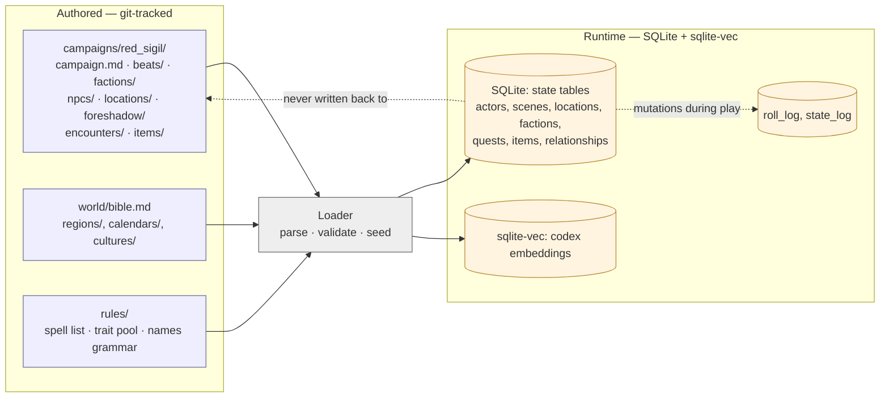
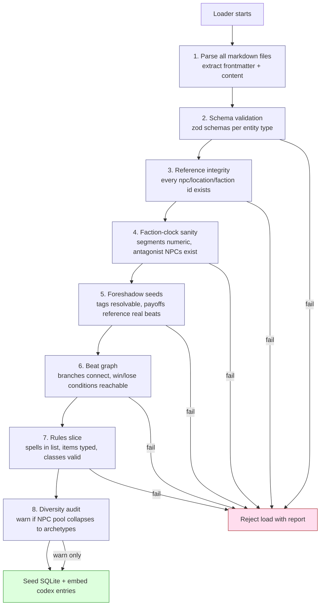
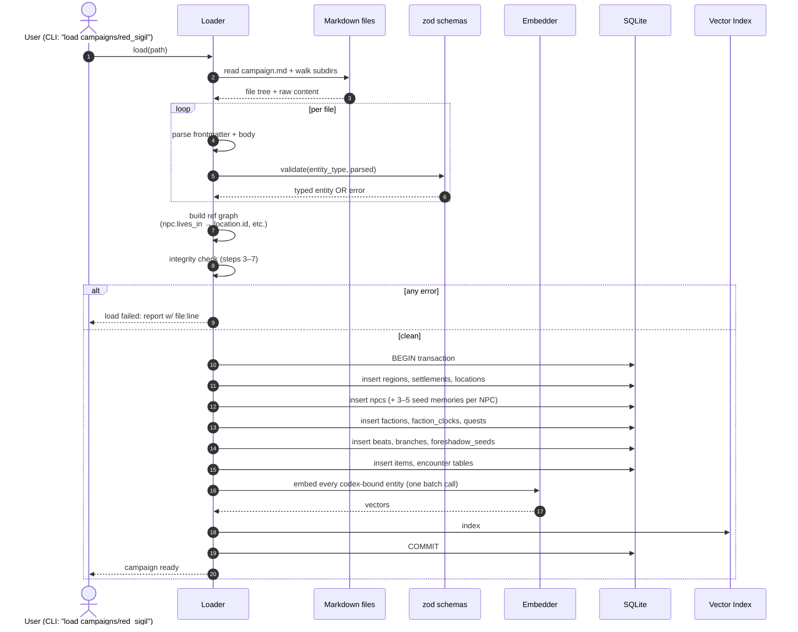
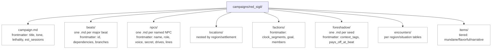
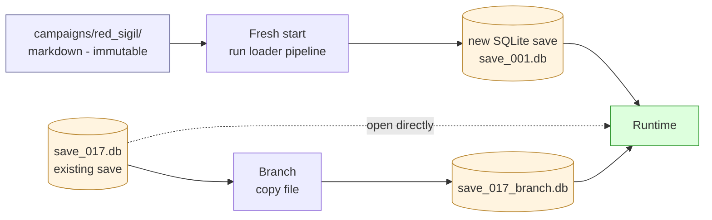

# Campaign Authoring + Validation

**Source**: [`01-storage.md`](../../01-storage.md), [`05-director.md`](../../05-director.md), [`TODO-BRAINSTORM.md`](../../TODO-BRAINSTORM.md) §Director & campaign authoring

A campaign is a **git repo of markdown** (the seed) that gets parsed,
validated, and loaded into a runtime SQLite DB (the state). Markdown is the
shareable, forkable, version-controlled artifact; SQLite is the mutating
play state. Updating an NPC's HP during play does *not* rewrite the markdown.

## Conceptual view — authored sources vs. runtime state

## Validation gates — what blocks a bad campaign from loading

A markdown campaign with broken references is worse than no campaign — you
discover it mid-session. The loader is strict.

Steps 2–7 are **blocking**; step 8 (diversity audit) is a warning so you can
intentionally ship a same-archetype campaign if that's the design.

## Sequence — campaign load

## Markdown structure (sketch — to be detailed)

The current sketch from [`TODO-BRAINSTORM.md`](../../TODO-BRAINSTORM.md) §Director & campaign authoring:

## Save / load interaction

Saves are copies of the runtime SQLite. The markdown is never modified.
Loading a save = open that SQLite file; loading a campaign = run this
pipeline to seed a fresh one.

## See also

- Why markdown + SQLite + vector split, not one of them: [`01-storage.md`](../../01-storage.md)
- What gets generated *during* play vs. authored upfront: [`02-entity-generation-pipeline.md`](02-entity-generation-pipeline.md)
- Foreshadow seed usage: [`../backstage/01-director-between-scenes.md`](../backstage/01-director-between-scenes.md)
- Save bundle format still open: [`08-cross-cutting.md`](../../08-cross-cutting.md) §Save/load
