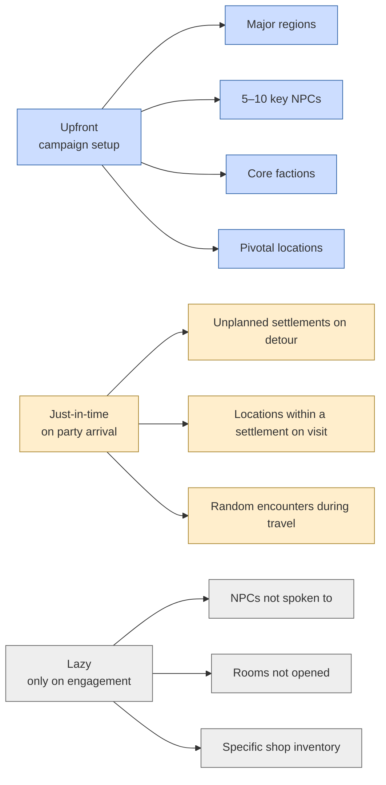
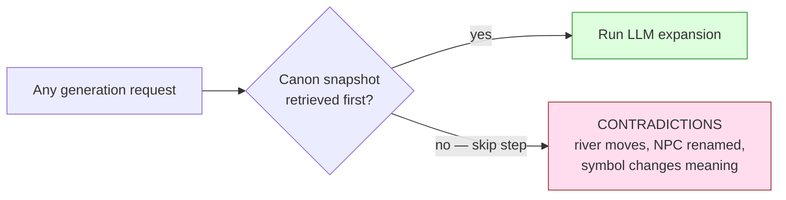
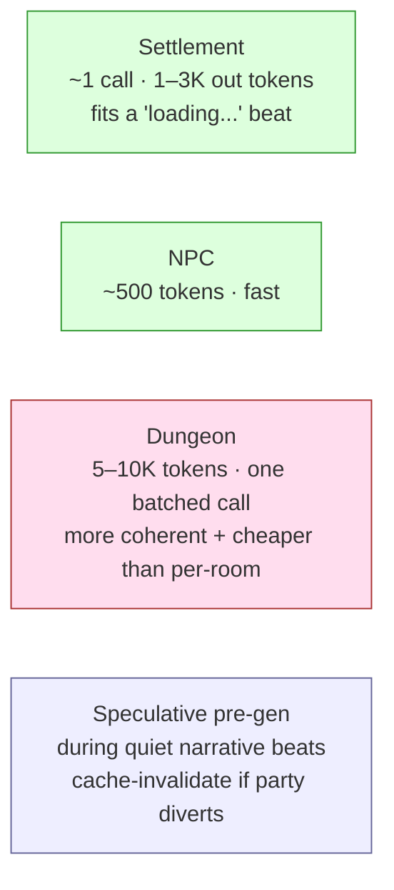

# Entity Generation Pipeline — The Two-Layer Pattern

**Source**: [`06-generation.md`](../../06-generation.md)

Every generated entity — NPC, settlement, dungeon, item — goes through the
same three-stage pipeline:

1. **Procedural skeleton** (no LLM) — weighted tables produce structural facts.
2. **Canon retrieval + LLM expansion** — the LLM gets the skeleton plus
   everything the codex already says about the parent context, and is told
   what *must* and *must not* be true.
3. **Canon commit** — output validated, written to SQLite, embedded into the
   codex. The entity is now permanent; future lookups return the stored
   version, never a regeneration.

This pattern is the discipline that prevents long-campaign contradictions and
keeps generated content from collapsing to LLM archetypes.

## Conceptual view — the three stages

```mermaid
flowchart LR
    Trigger[Generation trigger<br/>JIT arrival · DM request · pre-gen during quiet beat]

    subgraph S1[1. Procedural skeleton — no LLM]
        T1[Weighted table rolls<br/>size · industry · government · wealth · tension]
        T2[Trait pool selection<br/>weighted-excluding recently-used]
        T3[Naming grammar<br/>culture-appropriate syllable patterns]
    end

    subgraph S2[2. Canon retrieval + LLM expansion]
        R1[Codex query: parent + siblings + factions present]
        R2[Variety state: recent traits, names, archetypes used]
        R3[Recent party context]
        Prompt[Scoped prompt<br/>skeleton + canon + anti-archetype constraints]
        LLM[(LLM expansion)]
    end

    subgraph S3[3. Canon commit]
        V[Validate output shape]
        Wrt[Write to SQLite]
        Emb[Embed → sqlite-vec]
        Hooks[Register follow-up hooks<br/>"NPC mentioned brother — gen if asked"]
    end

    Trigger --> S1 --> S2 --> S3

    T1 --> Prompt
    T2 --> Prompt
    T3 --> Prompt
    R1 --> Prompt
    R2 --> Prompt
    R3 --> Prompt
    Prompt --> LLM --> V
    V --> Wrt
    V --> Emb
    V --> Hooks

    classDef proc fill:#eef,stroke:#669
    classDef llm fill:#fde,stroke:#a33
    classDef commit fill:#dfd,stroke:#393
    class T1,T2,T3,R1,R2,R3,Prompt proc
    class LLM llm
    class V,Wrt,Emb,Hooks commit
```

The LLM never sees stage 1. It only ever runs once per entity, with full
canon context, on a tightly-scoped prompt.

## Cadence — when each entity type generates



> Discipline: generate the thinnest layer that lets you narrate the current
> moment; expand the next layer only when the player engages.

## Sequence — generating an NPC on first interaction

The party walks into a tavern. The DM needs a barkeep with a name and a
voice — *now*. This is the JIT path.

```mermaid
sequenceDiagram
    autonumber
    participant DM as DM Agent
    participant T as Tool Surface
    participant Sk as Procedural Skeleton<br/>(no LLM)
    participant CanonQ as Canon Retrieval
    participant Gen as Generator Agent (LLM)
    participant V as Vector Index
    participant S as State Store

    DM->>T: generate_npc(parent_location="drunken_goose", role_hint="barkeep")
    T->>Sk: roll_skeleton(npc, region_context, recent_traits_used)
    Sk-->>T: { traits: [pragmatic, superstitious], voice_register: terse,<br/>name_seed: "Hallin", secret_table_roll: "owes the cult money" }

    T->>CanonQ: pull_relevant(parent=drunken_goose)
    CanonQ->>S: get settlement, region culture, present factions
    CanonQ->>S: get existing NPC names in town (to avoid dupes)
    CanonQ->>S: get recent party context (warm summary)
    S-->>CanonQ: bundle
    CanonQ-->>T: canon snapshot

    T->>Gen: prompt = skeleton + canon + anti-archetype constraints
    Note over Gen: "Do NOT make them gruff/grizzled —<br/>overrepresented in Greyhill region"
    Gen-->>T: { name, speech_sample, 3 backstory beats, appearance, mannerism }

    T->>T: validate shape (zod) + dedupe name vs. existing
    par parallel commits
        T->>S: insert npc row + initial disposition baseline
        T->>S: insert 3–5 seed npc_memories from backstory beats
        T->>V: embed name + speech_sample + secret → codex entry
        T->>S: register follow-up hooks ("Hallin mentioned a daughter")
    end
    T-->>DM: npc entity_id + voice exemplar + secret
    Note over DM: NPC now exists permanently; next visit returns stored version
```

## Per-entity variations

The shape is the same; the table rolls and prompt scaffolds differ.

```mermaid
flowchart TB
    Skel[Stage 1 skeleton]
    NPC[NPC<br/>2 traits + voice register + name grammar + secret]
    Set[Settlement<br/>size + industry + govt + wealth + notable + tension]
    Dung[Dungeon<br/>procedural room graph + 2-3 discoveries + 2-3 obstacles + 1 climax<br/>LLM does single batch dressing pass]
    Item[Item<br/>tier-based: mundane (no LLM) / flavorful (light) / narrative (full + provenance)]
    Enc[Encounter<br/>region table for type/threat + LLM for why & texture]

    Skel --> NPC
    Skel --> Set
    Skel --> Dung
    Skel --> Item
    Skel --> Enc

    classDef shape fill:#eef,stroke:#669
    class Skel,NPC,Set,Dung,Item,Enc shape
```

Dungeons are batch-generated (one big prompt for the whole site) for both
coherence and cost; per-room calls drift in tone and cost more.

## Anti-archetype countermeasures (in the prompt assembly)

```mermaid
flowchart LR
    P[Prompt assembly]
    AE[Anti-example list<br/>"Do NOT make them..."]
    TU[Trait-usage tracking<br/>weighted exclusion]
    NG[Naming grammars<br/>cultural cluster, no repetition]
    DS[Diverse-source seeding<br/>"alchemist / scholar / witch / hermit"]
    DV[Settlement diversity vector<br/>bias toward unfilled personality axes]

    AE --> P
    TU --> P
    NG --> P
    DS --> P
    DV --> P
    P --> LLM[Generator LLM]

    classDef ctrl fill:#fde,stroke:#a33
    class AE,TU,NG,DS,DV ctrl
```

## Canon preservation rule (single most important)



Every generation prompt starts with a retrieval pass. Skip it and by session
8 the bartender has a new name. This is the rule from
[`06-generation.md`](../../06-generation.md) §Canon preservation rule.

## Cost / latency profile



## See also

- The reusable `GenerationRequest<T>` / `GenerationResult<T>` contract: [`06-generation.md`](../../06-generation.md) §Reusable generation contract
- Where the seed memories from stage 3 are consumed: [`../core-loops/03-npc-reencounter-memory.md`](../core-loops/03-npc-reencounter-memory.md)
- Encounter-specific pipeline: [`03-scenario-encounter-generation.md`](03-scenario-encounter-generation.md)
- Tables themselves (40-trait pool, tension tables, naming grammars) — open: [`TODO-BRAINSTORM.md`](../../TODO-BRAINSTORM.md)
