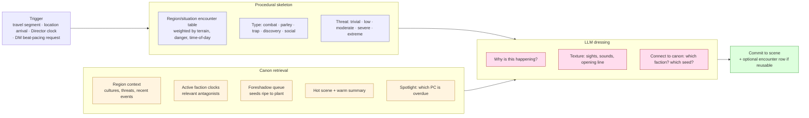
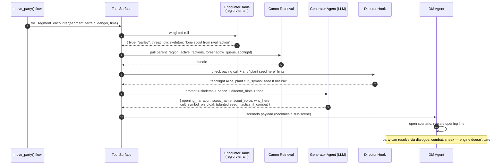
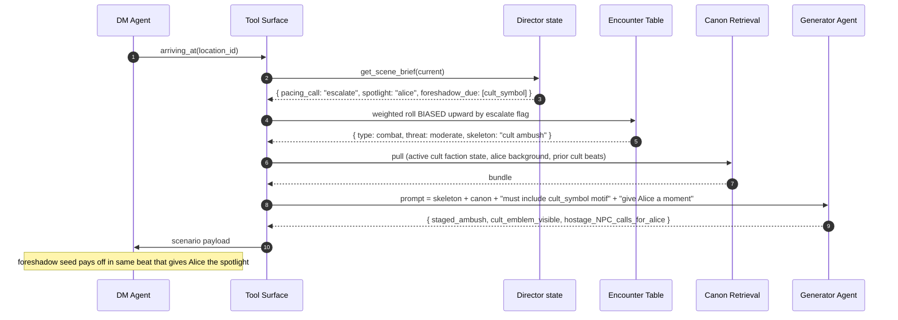
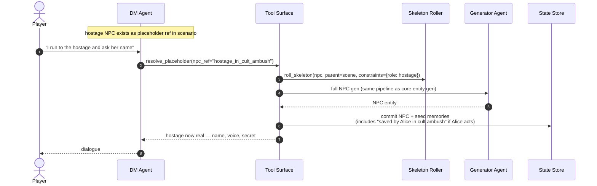

# Scenario / Encounter Generation

**Source**: [`06-generation.md`](../../06-generation.md), [`07-geography.md`](../../07-geography.md)

A *scenario* in this engine is a self-contained scene: combat, parley, trap,
discovery, social tension. Most aren't pre-authored — they're generated on
demand from a region/situation encounter table, then dressed by the LLM with
*why* and *texture* that fits the current canon and party context.

This is the same two-layer pattern as
[`02-entity-generation-pipeline.md`](02-entity-generation-pipeline.md), but
the table rolls and dressing prompt differ.

## Conceptual view — what an encounter generation pulls together



## Triggers — when scenario generation fires

```mermaid
flowchart TB
    A[Travel segment<br/>per-segment encounter roll]
    B[Location first-visit<br/>'what's happening here right now?']
    C[Director pacing call<br/>brief asks for escalation/breather]
    D[Faction clock tick<br/>visible evidence beat needed]
    E[DM explicit request<br/>"the party's hour passes uneventfully... or does it?"]

    A --> EncGen
    B --> EncGen
    C --> EncGen
    D --> EncGen
    E --> EncGen

    EncGen[Encounter generator]

    classDef trig fill:#eef,stroke:#669
    classDef gen fill:#fde,stroke:#a33
    class A,B,C,D,E trig
    class EncGen gen
```

Each trigger biases the skeleton roll: travel uses the terrain's table, a
faction clock tick biases toward that faction, a pacing "breather" call
biases away from combat.

## Sequence — travel segment encounter

The party is walking a forest trail. The travel system rolls on the segment's
encounter table.



## Sequence — Director-requested escalation

The Director's last brief flagged "pacing call: escalate". On the next
arrival, the engine generates a higher-pressure encounter than the table
would normally produce.



## Sequence — lazy NPC engagement during a scenario

The generated scenario references "a hostage NPC". Lazy-gen: only create the
hostage's full sheet if a player engages.



## What's reusable vs. one-shot

Some scenarios are worth keeping in the codex; most aren't.

```mermaid
flowchart LR
    G[Generated scenario]
    Q{Reusable or<br/>one-shot?}
    Keep[Promote to encounter table row<br/>"forest cult-scout patrol"<br/>so it can recur elsewhere]
    Hot[Stay as scene transcript only<br/>summarized to warm, eventually cold]

    G --> Q
    Q -- reusable archetype --> Keep
    Q -- specific to this moment --> Hot

    classDef ok fill:#dfd,stroke:#393
    classDef hot fill:#fec,stroke:#a83
    class Keep ok
    class Hot hot
```

Promotion is conservative — most scenarios are *specific* and shouldn't
recur identically. But "cult-scout patrol" as an archetype is fair game.

## See also

- The same two-layer pattern applied to entities: [`02-entity-generation-pipeline.md`](02-entity-generation-pipeline.md)
- Where travel-segment encounter rolls come from: [`../travel/01-party-movement-flow.md`](../travel/01-party-movement-flow.md)
- Director's pacing call and foreshadow queue: [`../backstage/01-director-between-scenes.md`](../backstage/01-director-between-scenes.md)
- Why the encounter table itself is authored, not generated: [`06-generation.md`](../../06-generation.md) §What gets generated
