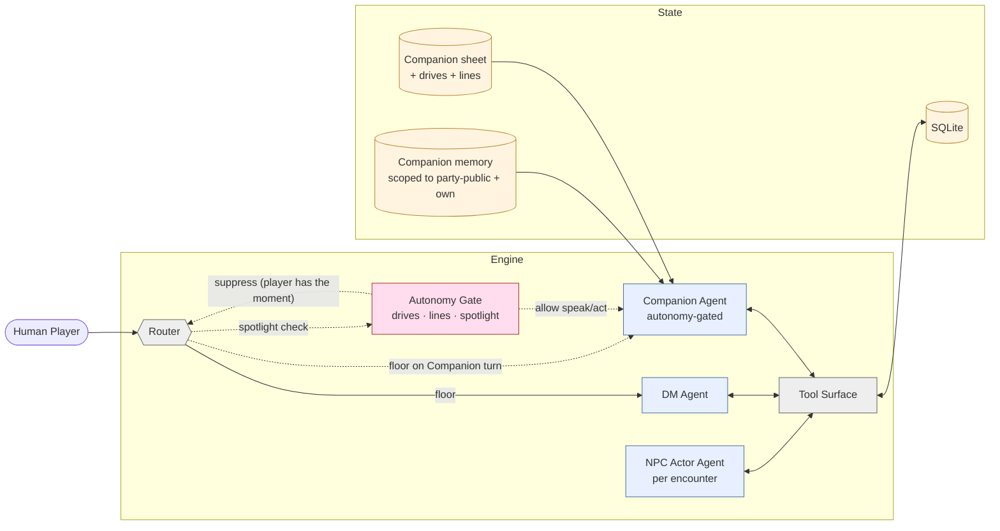
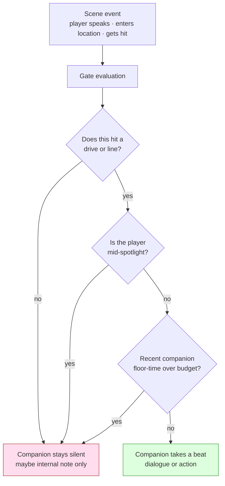
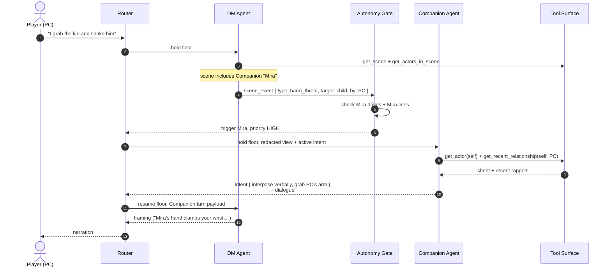
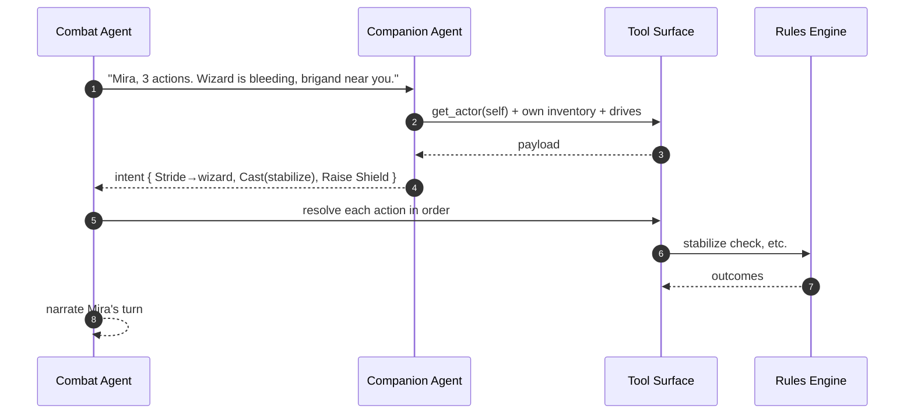

# Solo + AI Companion — Autonomy Gates

**Source**: [`00-overview.md`](../../00-overview.md) §Agent layout, [`02-tools-orchestration.md`](../../02-tools-orchestration.md)

A Companion is a party-facing actor controlled by an agent rather than a
human. The trick: it shouldn't *steal* scenes from the player. The Companion
agent is governed by **autonomy gates** — drives (what this character cares
about) and lines (what they won't do) — that decide whether they speak / act
spontaneously or stay silent and let the player drive.

## Conceptual view — where the Companion sits



## How the gate decides

The Companion has *opinions*, but firing them every beat is exhausting.
The gate filters them.



`Drives` are short structured tags (e.g. `drive: "redeem brother's memory"`,
`drive: "protect children"`). `Lines` are hard rules (e.g. `line: "won't harm
the innocent"`). Both are stored on the Companion sheet and evaluated each
beat. Spotlight + floor-budget come from the Director's spotlight tracker
(see [`../backstage/01-director-between-scenes.md`](../backstage/01-director-between-scenes.md)).

## Sequence — a Companion intervenes mid-scene

The player is interrogating a child. The Companion has `line: "won't harm
the innocent"`. The gate fires.



## Sequence — Companion proposes an action on their own turn

In combat or any actor-based round, the Companion is just another actor — the
Combat agent or DM asks it for intent on its turn.



## Player escape hatches

Players need to be able to overrule a Companion ("Mira, stand down") and to
freeze their autonomy when they want to drive the scene alone.

```mermaid
flowchart LR
    PCmd[Player says<br/>"Mira, hold"]
    Listen[Engine intercepts<br/>imperative-to-companion]
    Pause[Autonomy Gate<br/>suppress Mira N turns]
    Resume[Resume after N or on cue]

    PCmd --> Listen --> Pause --> Resume

    classDef ux fill:#eef,stroke:#669
    class PCmd,Listen,Pause,Resume ux
```

## See also

- Multiple humans + Companions at the same table: [`02-multiplayer-table.md`](02-multiplayer-table.md)
- Spotlight tracker (the Director input that the gate consults): [`../backstage/01-director-between-scenes.md`](../backstage/01-director-between-scenes.md)
- Why Companion reads are scoped: [`02-tools-orchestration.md`](../../02-tools-orchestration.md) §Agent permissioning matrix
