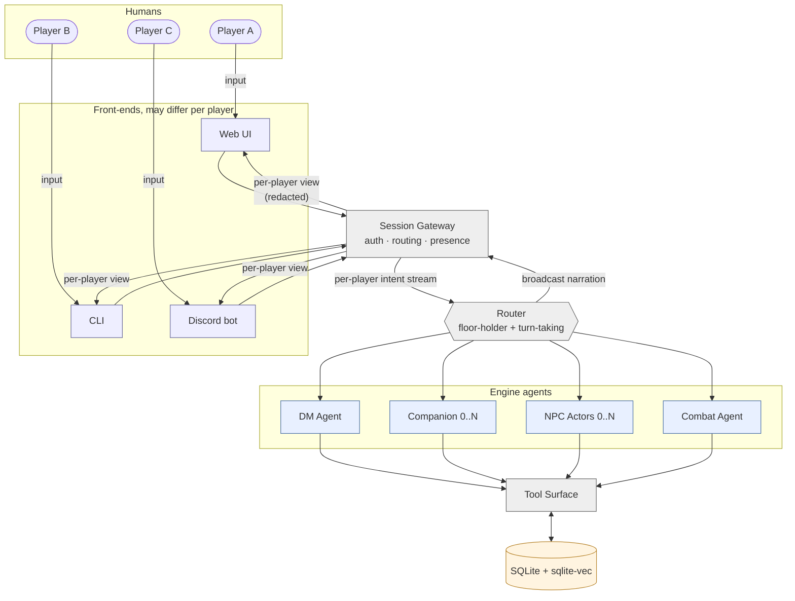
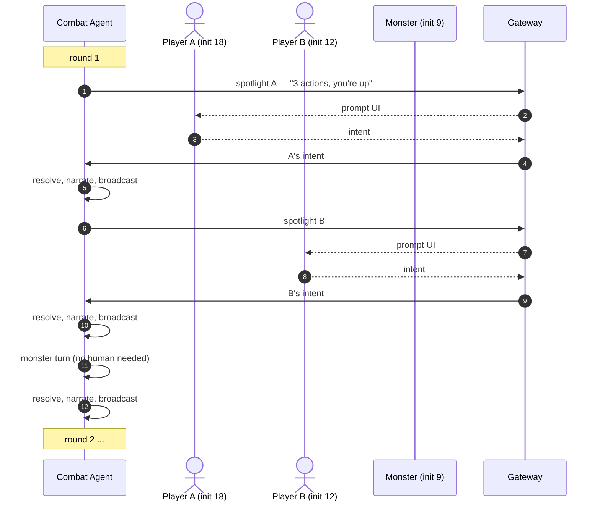
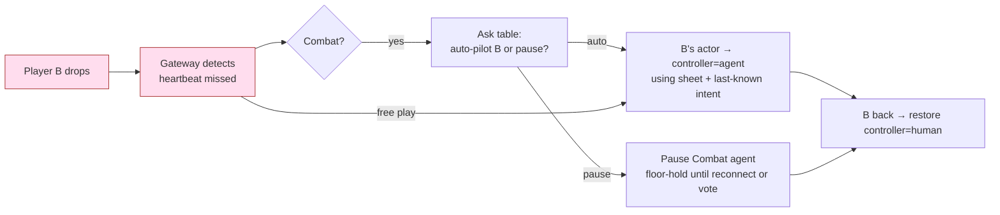

# Multiplayer Table — Shared Engine, Many Humans

**Source**: [`00-overview.md`](../../00-overview.md), [`OPEN-QUESTIONS.md`](../../OPEN-QUESTIONS.md) §UI/interfaces

The actor abstraction (`controller: 'human' | 'agent' | 'dm'`) means
multiplayer is just "more actors with `controller: human`." The engine
doesn't fundamentally change. What changes is the front-end fan-out and the
turn-taking rules.

## Conceptual view



Two new pieces vs. solo:

- **Session Gateway** — accepts connections, identifies which player is which actor, fans broadcasts back out. Each front-end is just a transport.
- **Per-player view** — narration broadcast is the same, but a player whispering to an NPC or examining their inventory gets a private channel. This is the *same* tool-layer redaction as for NPCs, just applied to humans.

## Turn-taking in multiplayer free play

Free play (out of combat) is "first speaker wins" with backpressure: the
Router buffers inputs from other players and feeds them in serially so the DM
gets one beat to respond to before the next arrives.

```mermaid
sequenceDiagram
    autonumber
    actor A as Player A
    actor B as Player B
    actor C as Player C
    participant G as Gateway
    participant R as Router
    participant DM as DM Agent

    par players speak roughly at once
        A->>G: "I climb the wall"
        B->>G: "I cover with my bow"
        C->>G: "I check the door"
    end
    G->>R: inputs A, B, C with timestamps
    R->>R: queue by arrival; collapse to one DM call when natural
    R->>DM: "scene beat: A climbs, B covers, C inspects door"
    DM->>DM: resolve as concurrent — checks per actor
    DM-->>R: narration referencing all three
    R-->>G: broadcast
    G-->>A: stream
    G-->>B: stream
    G-->>C: stream
```

The Router doesn't always batch. Single-speaker beats (one player has a long
dialogue exchange with an NPC) get sequential turns just like solo. The
heuristic is: collapse intents into one beat if they're plausibly happening
simultaneously, otherwise serialize.

## Turn-taking in multiplayer combat

Combat is initiative-ordered; this is where multiplayer is easiest. The
Combat agent asks each actor in turn, regardless of whether they're human or
agent-controlled.



Idle players see the narration as it streams. The actor whose turn it is gets
an additional UI affordance (input field unlocked, action chips highlighted).

## Per-player redaction

A player examining their own inventory shouldn't broadcast the contents to
the table. A player whispering to an NPC shouldn't be seen by the other PCs.
The Gateway routes these through the same tool surface but tags the
broadcast scope.

```mermaid
flowchart LR
    PCAct[Player action]
    Scope{Action scope}
    BcastAll[Broadcast to all<br/>narration, public dialogue]
    BcastSelf[To self only<br/>inventory, sheet, private thoughts]
    BcastNPC[To self + NPC<br/>whispered dialogue]
    BcastSubset[To subset<br/>"I tell Alice quietly"]

    PCAct --> Scope
    Scope -- public --> BcastAll
    Scope -- private --> BcastSelf
    Scope -- whisper-NPC --> BcastNPC
    Scope -- whisper-PCs --> BcastSubset

    classDef public fill:#dfd,stroke:#393
    classDef private fill:#fde,stroke:#a33
    class BcastAll public
    class BcastSelf,BcastNPC,BcastSubset private
```

## Disconnect / drop handling



The actor abstraction makes this clean: flipping a `controller` field is the
whole change. The agent that takes over uses the player's sheet, recent
choices, and party-public knowledge as context.

## See also

- Why "more humans" doesn't change the engine: [`00-overview.md`](../../00-overview.md) §Actor abstraction
- The same tool-layer redaction used here: [`02-tools-orchestration.md`](../../02-tools-orchestration.md) §Key invariants
- Front-end choices currently open: [`OPEN-QUESTIONS.md`](../../OPEN-QUESTIONS.md) §UI/interfaces
