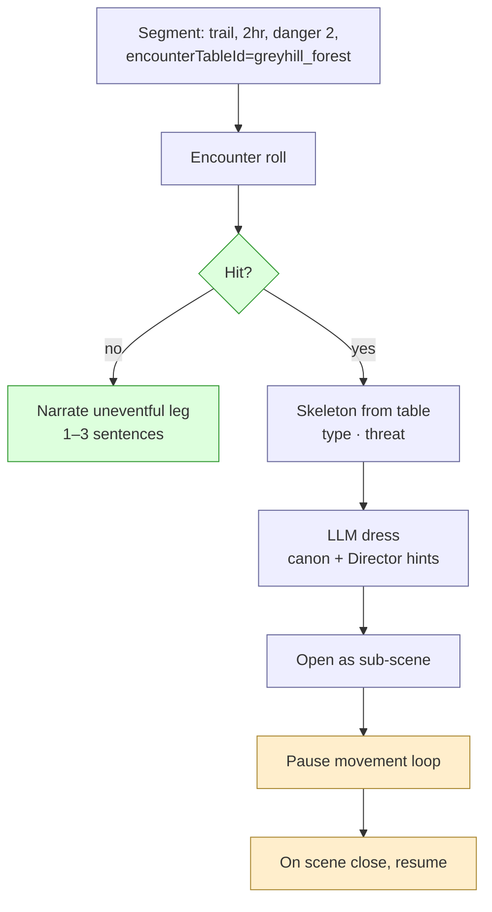
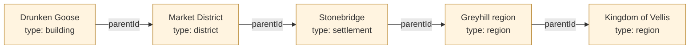

# Party Movement Flow — `move_party()`

**Source**: [`07-geography.md`](../../07-geography.md)

Geography is an **adjacency graph** in SQLite: locations are nodes, edges
carry distance, terrain, travel time per mode, danger, direction, gating
requirements, and an optional encounter table. The DM never invents
geography — every "what's east?" answer is a graph query.

`move_party()` is the one big flow that ties geography to the rest of the
engine: pathfinding, time advancement, per-segment encounters, the Director
hook on big advances, and arrival framing.

## Conceptual view — the spatial model

```mermaid
flowchart TB
    subgraph Graph[Adjacency graph in SQLite]
        L1((Drunken Goose))
        L2((Market District))
        L3((Stonebridge))
        L4((Forest Trail))
        L5((Greyhill Wilds))
        L6((Hollow Tor))
        L1 -- in --> L2
        L2 -- in --> L3
        L3 -- E road, 30min foot --> L4
        L4 -- NE trail, 2hr, danger 2 --> L5
        L5 -- N, requires "old key" --> L6
    end

    Party[(Party state<br/>current_location_id +<br/>simultaneously at every ancestor)]

    Graph --> Party

    classDef node fill:#fff4e0,stroke:#b8862f
    classDef party fill:#dfd,stroke:#393
    class L1,L2,L3,L4,L5,L6 node
    class Party party
```

The party is at every ancestor simultaneously — *Drunken Goose → Market
District → Stonebridge → Greyhill region → Kingdom of Vellis*. Region-level
events affect anyone in the region; settlement-level affect anyone in the
settlement.

## `move_party()` — the five stages

```mermaid
flowchart LR
    Req[Player intent:<br/>"travel to Hollow Tor"]
    R1[1. Reachability check]
    R2[2. Pathfinding]
    R3[3. Per-segment loop]
    R4[4. Director hook<br/>on big time advance]
    R5[5. Arrival framing]

    Req --> R1 --> R2 --> R3 --> R4 --> R5

    classDef step fill:#eef,stroke:#669
    classDef start fill:#dfd,stroke:#393
    class Req start
    class R1,R2,R3,R4,R5 step
```

Stage 4 only fires if the cumulative time advance is "significant" (TBD
threshold — likely > 4 hours of game time or any overnight rest).

## Sequence — full `move_party()` flow

```mermaid
sequenceDiagram
    autonumber
    actor P as Player
    participant DM as DM Agent
    participant T as Tool Surface
    participant G as Geography (graph queries)
    participant S as State Store
    participant ET as Encounter Tables
    participant Dir as Director
    participant Gen as Scenario Generator

    P->>DM: "We head for Hollow Tor"
    DM->>T: move_party(from=stonebridge, to=hollow_tor, prefer="safest")

    rect rgb(245,245,255)
    Note over T,G: 1. Reachability check
    T->>G: get_path(stonebridge → hollow_tor)
    G->>S: traverse edges; check requires
    S-->>G: edge requires "old key" — party has it? yes
    G-->>T: path candidates [shortest, safest, fastest]
    end

    rect rgb(240,250,240)
    Note over T,P: 2. Pathfinding + preference
    T-->>DM: "shortest=4h danger3 / safest=6h danger1 / fastest=3h horse danger2"
    DM-->>P: "Three routes — your call?"
    P-->>DM: "safest"
    end

    rect rgb(255,250,240)
    Note over T,Gen: 3. Per-segment loop (3 segments on this path)
    loop per segment
        T->>T: advance_time(segment.travel_time)
        T->>ET: roll(segment.encounterTableId)
        alt encounter rolled
            ET-->>T: skeleton (e.g. cult-scout patrol)
            T->>Gen: dress scenario (see generation/03)
            Gen-->>T: scenario payload
            T-->>DM: scenario opens<br/>(loops back to scene loop; movement pauses)
            Note over DM: party resolves scenario; on close, T resumes loop
        else no encounter
            T-->>DM: 1–3 sentence narration of leg
            DM-->>DM: narrate
        end
        T->>S: append PartyMovementLog entry
    end
    end

    rect rgb(250,240,255)
    Note over T,Dir: 4. Director hook (big time advance accumulated)
    T->>Dir: trigger between-scene run (overnight elapsed)
    Dir-->>T: brief: faction clocks ticked, off-screen NPCs moved
    Note over Dir: see backstage/01-director-between-scenes.md
    end

    rect rgb(240,255,250)
    Note over T,DM: 5. Arrival framing
    T->>S: party.current_location_id = hollow_tor
    T->>S: check first_visit?
    alt first visit
        T->>Gen: generate_location(hollow_tor) if not yet expanded
        Gen-->>T: location dressing
        T-->>DM: "first-visit" framing payload + Director brief
    else return visit
        T->>S: get_location + recent_changes_since_last_visit
        S-->>T: "the tor has changed since: ..." (from Director ticks)
        T-->>DM: "return-visit" framing payload
    end
    DM-->>P: arrival narration
    end
```

## Per-segment encounter — zoom in



## DM-side tool surface for geography

The DM agent never invents geography. The graph queries are the only source
of truth.

```mermaid
flowchart LR
    DM[DM Agent]
    subgraph Tools
        N[get_neighbors id, withDirection<br/>"what's adjacent + where"]
        P[get_path from, to, prefer<br/>"ordered edges + total cost"]
        Ctx[get_location_context id<br/>"parent chain for zoom narration"]
        Desc[describe_surroundings id, range<br/>"pre-formatted summary to paraphrase"]
        MP[move_party<br/>"the flow above"]
    end
    Graph[(SQLite graph)]

    DM --> N
    DM --> P
    DM --> Ctx
    DM --> Desc
    DM --> MP
    N --> Graph
    P --> Graph
    Ctx --> Graph
    Desc --> Graph
    MP --> Graph

    classDef agent fill:#e8f0ff,stroke:#4a6fa5
    classDef tool fill:#eee,stroke:#666
    classDef store fill:#fff4e0,stroke:#b8862f
    class DM agent
    class N,P,Ctx,Desc,MP tool
    class Graph store
```

So "what's to the east?" → `get_neighbors(current, withDirection=true)` →
real answer. No hallucinated mountains.

## Zoom — parent-chain narration



A region-level event (war erupts) is applied at level D; everyone in
Stonebridge, the Market District, and the Drunken Goose feels it on next
narration. A building-level event (a stranger sits at the bar) lives at A.

## Open

- Mounted / vehicle / teleport mechanics (currently foot/horse/boat only).
- Weather as a region-scale state affecting `travelTime` and `dangerLevel`.
- Hex-crawl wilderness mode vs. point-to-point — toggle per region?

See [`07-geography.md`](../../07-geography.md) §Open for the full list.

## See also

- The graph schema (Location / LocationEdge / PartyMovementLog): [`07-geography.md`](../../07-geography.md) §Schema
- Encounter generation triggered from segments: [`../generation/03-scenario-encounter-generation.md`](../generation/03-scenario-encounter-generation.md)
- Director hook on time advance: [`../backstage/01-director-between-scenes.md`](../backstage/01-director-between-scenes.md)
- Why graph over GeoJSON: [`07-geography.md`](../../07-geography.md) §GeoJSON
